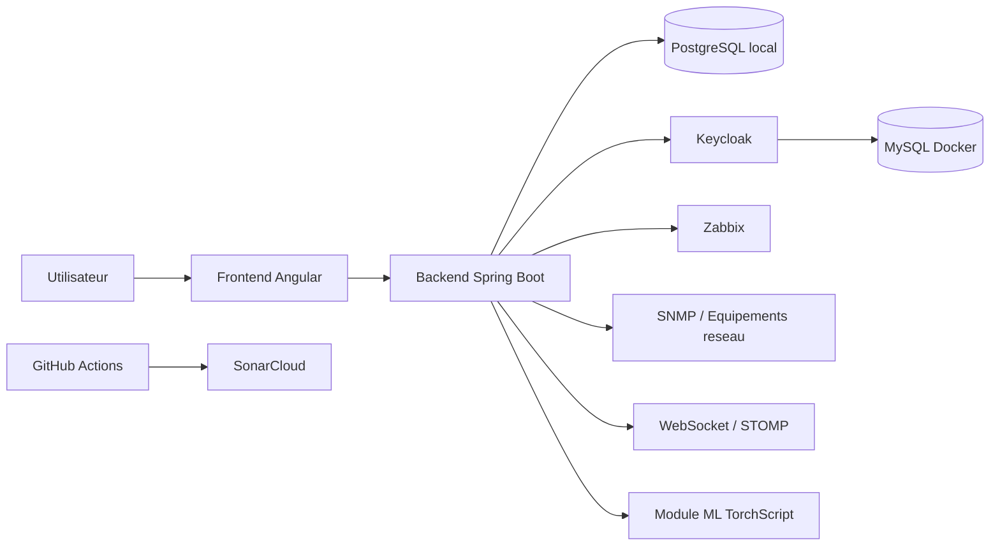
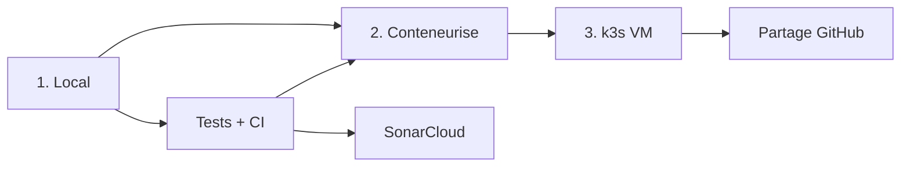

# Plateforme intelligente de supervision centralisee et d'aide a la decision


Solution de fin d'études réalisée pour la **Mediterranean School of Business (MSB)**.
Le projet vise à unifier la supervision d'une infrastructure hétérogène, à faciliter le traitement des incidents et à fournir une aide à la décision via un module de **prédiction ML de sévérité**.

> Projet academique realise dans le cadre d'un Projet de Fin d'Etudes.
> Certaines configurations sensibles, secrets, adresses internes et donnees reelles ne sont pas incluses dans ce depot.

## Statut du projet

- Projet de fin d'etudes
- Version de demonstration academique
- Depot pense pour la presentation, la documentation et la valorisation GitHub

## Vue d'ensemble

La plateforme exploite plusieurs solutions specialisees de supervision et d'exploitation :

- `Zabbix` pour la supervision des serveurs et services
- `SNMP` pour les equipements reseau
- des `cameras IP` pour la video-surveillance

Le probleme principal n'etait pas l'absence d'outils, mais leur **fragmentation**.
Chaque source a ses propres interfaces, ses propres formats de donnees et ses propres mecanismes d'acces, ce qui complique la supervision quotidienne, la correlation des incidents et la prise de decision.

La solution developpee propose une plateforme unique qui :

- centralise les donnees de supervision
- unifie les vues de monitoring
- gere les incidents et le ticketing
- diffuse les evenements en temps reel
- applique des mecanismes de resilience
- integre une prediction ML de severite

## Architecture fonctionnelle

| Couche | Role principal |
|---|---|
| Frontend Angular | Interface utilisateur, dashboards, ticketing, chat, notifications et administration |
| Backend Spring Boot | API metier, orchestration, securite, aggregation, persistence et communication temps reel |
| Securite Keycloak / JWT / RBAC | Authentification centralisee, autorisation par roles et controle d'acces |
| Integration supervision | Connexion aux sources externes : Zabbix, SNMP, cameras IP |
| Resilience | `Retry`, `TimeLimiter`, `Fallback`, `Circuit Breaker` via Resilience4j |
| Machine Learning | Entrainement Python, export TorchScript et inference cote backend |

## Architecture



### Vue logique

- le frontend concentre l'experience utilisateur
- le backend orchestre les APIs, la supervision et la securite
- PostgreSQL conserve les donnees metier
- Keycloak et MySQL forment la brique identite
- Zabbix, SNMP et les capteurs du terrain alimentent la supervision
- le module ML produit une prevision de severite exploitable dans l'interface

## Responsabilites par couche

### 1. Frontend

Le frontend est developpe avec **Angular**. Il est responsable de :

- l'affichage des tableaux de bord
- la consultation des incidents et tickets
- la collaboration temps reel via WebSocket/STOMP
- les notifications
- l'administration des utilisateurs et des roles
- la consultation des donnees de supervision unifiees

### 2. Backend metier

Le backend est developpe avec **Spring Boot 3** et constitue le coeur de la solution.
Il est responsable de :

- l'exposition des API REST
- l'agregation des donnees multi-sources
- la normalisation des donnees de monitoring
- la gestion des tickets et des incidents
- l'integration de Zabbix, SNMP et cameras IP
- la publication d'evenements temps reel
- la securisation des acces
- l'orchestration des mecanismes de resilience
- l'inference du modele ML

### 3. Securite et identite

La securite repose sur :

- `Keycloak` pour l'authentification centralisee
- `JWT` pour les sessions et les echanges securises
- `RBAC` pour le controle d'acces base sur les roles
- `Spring Security` pour la protection des endpoints REST et WebSocket

### 4. Couche d'integration

Cette couche isole les specificites techniques des systemes externes.

Elle permet de :

- recuperer les donnees de supervision
- gerer les differences de protocoles et de formats
- eviter le couplage direct entre le noyau metier et les outils tiers
- preparer des DTO homogenes pour le reste de l'application

### 5. Resilience

La plateforme integre **Resilience4j** pour preserver la continuité de service dans les cas de degradation ou d'indisponibilite partielle.

Les mecanismes utilises sont :

- `Retry`
- `TimeLimiter`
- `Circuit Breaker`
- `Fallback`

### 6. Machine Learning

Le module ML est construit autour de :

- `PyTorch` pour l'entrainement
- `TorchScript` pour l'export du modele
- inference cote backend a partir du modele TorchScript exporte

Objectif : produire une **prediction ML de severite** a partir des donnees de supervision disponibles.

## Structure du depot

```text
.
├── Backend/        # API Spring Boot, securite, monitoring, ticketing, chat, ML inference
├── FrontEndF/      # Application Angular
├── PFERTC/         # Pipeline ML Python, artefacts et modeles TorchScript
├── docker/         # Services d'infrastructure : Keycloak, MySQL, phpMyAdmin
├── k8s/            # Deploiement Kubernetes / k3s
├── docs/           # Captures d'ecran et documentation
└── .github/        # Automatisation GitHub
```

## Modules principaux

### Backend

Le backend contient notamment :

- les controlleurs REST
- les services de supervision
- les services SNMP
- les services Zabbix
- les services de ticketing
- la gestion des notifications
- la couche WebSocket/STOMP
- les regles de securite
- les mecanismes de resilience
- l'integration ML

### Frontend

Le frontend contient :

- les pages dashboard
- les composants de supervision
- la gestion des utilisateurs
- l'authentification
- les vues temps reel
- les interfaces de ticketing et de collaboration

### PFERTC

`PFERTC` regroupe le pipeline ML :

- preparation des donnees
- feature engineering
- entrainement
- comparaison de modeles
- export vers TorchScript
- artefacts de validation

### Docker

`docker/` contient l'environnement d'infrastructure d'accompagnement :

- `MySQL` pour Keycloak
- `Keycloak`
- `phpMyAdmin`

## Securite et confidentialite

Ce depot ne contient pas :

- de mots de passe reels
- de secrets Keycloak
- de tokens Zabbix
- d'adresses IP internes sensibles
- de donnees de production

Les variables sensibles doivent etre configurees localement a partir des fichiers `.env.example`.

## Prerequis

- Java 17
- Node.js 18+ ou 20+
- Maven Wrapper (`mvnw`)
- npm
- une base PostgreSQL accessible pour le backend
- Docker et Docker Compose pour Keycloak, MySQL et phpMyAdmin

## Demarrage rapide

### 1. Lancer l'infrastructure d'identite

```bash
cd docker
docker compose up -d
```

### 2. Configurer le backend

Creer les variables d'environnement a partir de `Backend/.env.example`.

Principales variables :

- `SPRING_DATASOURCE_URL`
- `SPRING_DATASOURCE_USERNAME`
- `SPRING_DATASOURCE_PASSWORD`
- `KEYCLOAK_BASE_URL`
- `KEYCLOAK_REALM`
- `KEYCLOAK_CLIENT_ID`
- `KEYCLOAK_CLIENT_SECRET`
- `ZABBIX_USERTOKEN`
- `SNMP_TOKEN`
- `ML_TORCHSCRIPT_ENABLED`

### 3. Demarrer le backend

```bash
cd Backend
./mvnw spring-boot:run
```

Le backend ecoute par defaut sur le port `8099`.

### 4. Demarrer le frontend

```bash
cd FrontEndF
npm install
npm start
```

Le frontend Angular ecoute par defaut sur le port `4200`.

## Ports par defaut

| Service | Port |
|---|---:|
| Frontend Angular | `4200` |
| Backend Spring Boot | `8099` |
| Keycloak | `8091` |
| MySQL Docker pour Keycloak | `3360` |

## Apercu des interfaces

### Interface de login


### Gestion des utilisateurs


### Supervision Zabbix


## Qualite et tests

Le projet contient des tests ciblant :

- la securite
- les controlleurs
- la supervision SNMP
- la resilience
- le ticketing
- le chat
- le module ML

## DevOps

Le projet est structure autour de 3 niveaux d'execution et de livraison:

| Niveau | Objectif | Contenu |
|---|---|---|
| 1 | Local | Backend Spring Boot, frontend Angular, PostgreSQL local |
| 2 | Conteneurise | Images Docker backend/frontend, stack Keycloak/MySQL |
| 3 | Orchestration k3s | Deploiement VM avec ingress et services exposes |



### Workflow DevOps

1. Developper et tester en local
2. Construire les images Docker
3. Valider avec la CI GitHub Actions et SonarCloud
4. Deployer sur k3s pour la VM cible
5. Publier la version finale sur GitHub avec README, captures et documentation

### Chaine de livraison

- code source dans le depot GitHub
- build automatise via GitHub Actions
- analyse qualite via SonarCloud
- execution locale et conteneurisee
- deploiement cible via k3s

## Points forts

- supervision centralisee
- architecture modulaire
- securite centralisee avec Keycloak
- communication temps reel
- ticketing integre
- resilience applicative
- aide a la decision par ML

## Auteur

**Wajdi Ben Ameur**  
Projet de fin d'études - MSB  
Spécialité : Génie Logiciel et Systèmes d'Information


